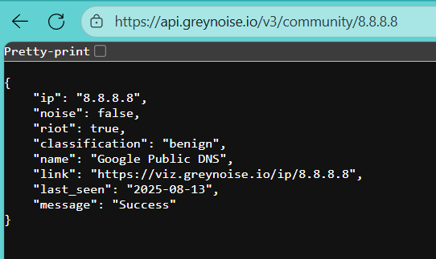

# GreyNoise RIOT ETL Connector - Jithu Morrison S - 3122225001051

## Overview

This project implements an ETL (Extract, Transform, Load) pipeline to fetch data from an API, process it, and store it in MongoDB.  
It is designed with error handling, secure authentication, and best practices for data ingestion.

---

## Features

- **Secure API Authentication** using `.env` environment variables
- **ETL Workflow**:
  - **Extract**: Fetch data from an API provider
  - **Transform**: Clean, validate, and prepare the data
  - **Load**: Insert into MongoDB with timestamps
- **Error Handling** for:
  - Invalid responses
  - Empty payloads
  - Rate limits
  - MongoDB connectivity issues
- **Modular Collection Strategy**: Separate collections for each connector
- **Audit Support**: Store timestamps

---

## Guideline: Building and Managing Custom Data Connectors (ETL Pipeline) in Python

1. Setting Up the Connector Environment
   a. Chose GreyNoise API: Chose and understood its Base URL, Endpoints, and Authentication.
   b. Understood the API Documentation: Focus on headers, query params, pagination, rate limits, and response structure.\\
   

2. Secure API Authentication Using Environment Variables
   a. Created a `.env` File Locally: Stored API url.
   b. Loaded Environment Variables in Code: Used `dotenv` to securely load environment variables.

3. Design the ETL Pipeline
   Extract: Connects to the API, gets JSON data from API URL.
   Transform: Cleaning or reformating the data.
   Load: Stored the transformed data into a MongoDB.

4. MongoDB Collection Strategy
   Used one collection per connector.
   Storing timestamps to support audits or updates.\\
   

5. Iterative Testing & Validation
   Tested for invalid responses, empty payloads, rate limits, and connectivity errors.
   Ensured consistent insertion into MongoDB.
   

6. Git and Project Structure Guidelines
   a. Used a Central Git Repository: Cloned the shared repo and created a new branch in my name.
   b. Ignored Secrets: Added `.env` to `.gitignore` before the first commit.
   c. Push and Document: Wrote README.md with endpoint details, API usage, and example output.
   

---

## Prerequisites

- Python 3.8+
- MongoDB (MongoDB Compass)
- API access from your chosen provider

---

## Project Structure

/JithuMorrisonS-3122225001051/
├── etl_connector.py
├── .env
├── requirements.txt
├── README.md
├── extract.py
├── transform.py
├── load.py
└── .gitignore

- **`.env`**: Stores sensitive credentials.
- **`etl_connector.py`**: main ETL script.
- **`requirements.txt`**: List all Python dependencies.
- **`README.md`**: Instructions for your connector.

---

## Configuration

The connector reads settings from environment variables. You must create a .env file based on the ENV_TEMPLATE provided.

API_URL="your api url"
MONGO_URI="your mongo url"
DB_NAME="your database name"
COLLECTION_NAME="your collection name"

---

Thank You! 🚀
